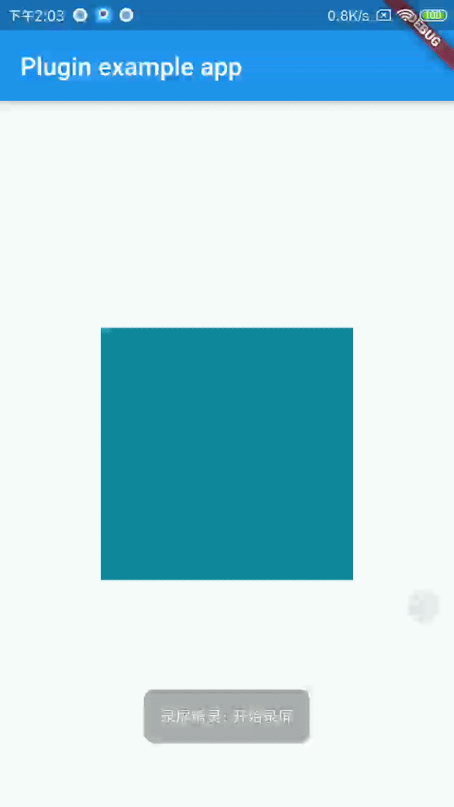

# external_plugin

这是一个Flutter外接纹理的Plugin。

这个flutter plugin目前只有Android端的实现，使用了SurfaceTexture（共享内存）的方式来实现外接纹理。

介绍如何在flutter端渲染native的OpenGL代码。

相关文章链接：

[谈一谈Flutter外接纹理](https://mp.weixin.qq.com/s?__biz=MzI0OTE5NTEwNg==&mid=2247483673&idx=1&sn=a41fe8839a15a85bc0196155bc998b2d&chksm=e9947e14dee3f702b824a843c57d114862e27ce389b783c7a7cdc68eb336bee209d619a8898b&mpshare=1&scene=23&srcid=0808L3vGP1J86O6R8vjtuGSD&sharer_sharetime=1596897357680&sharer_shareid=8de1fc30850dcbd89ea7dcdc7e5f5d25%23rd)

Demo:

> iOS的实现可以参考 https://github.com/luoyibu/flutter_texture

